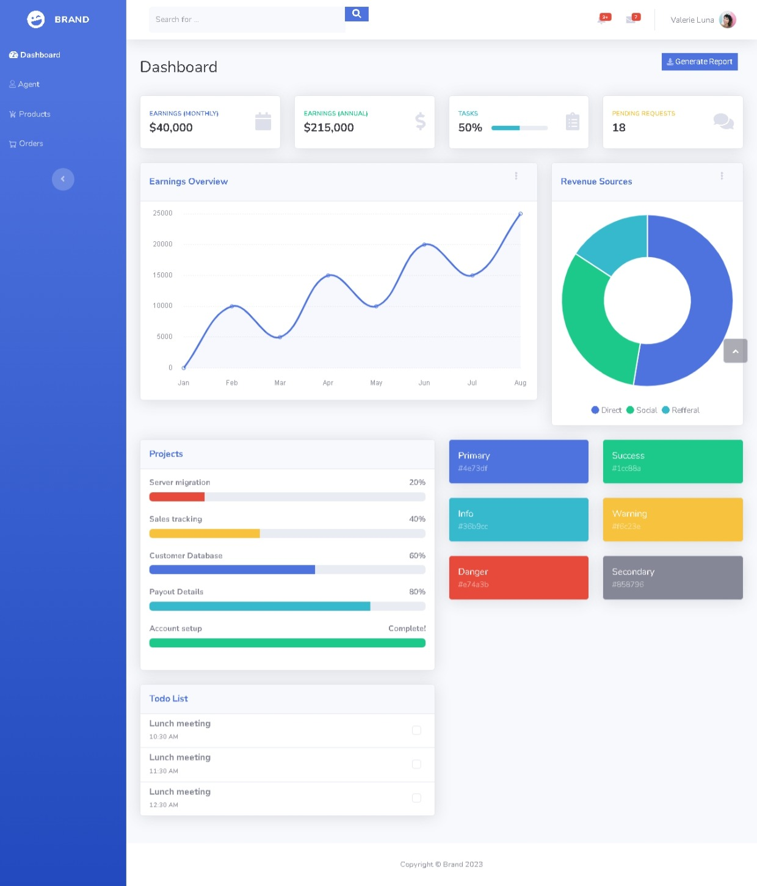
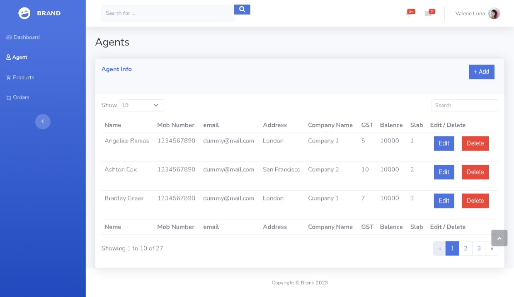
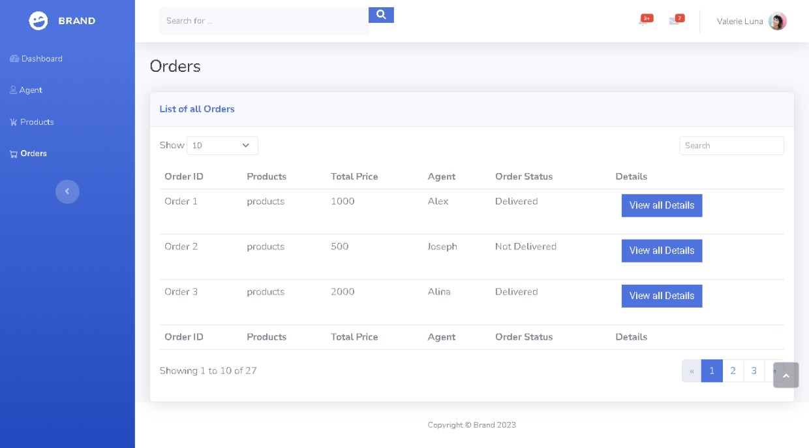
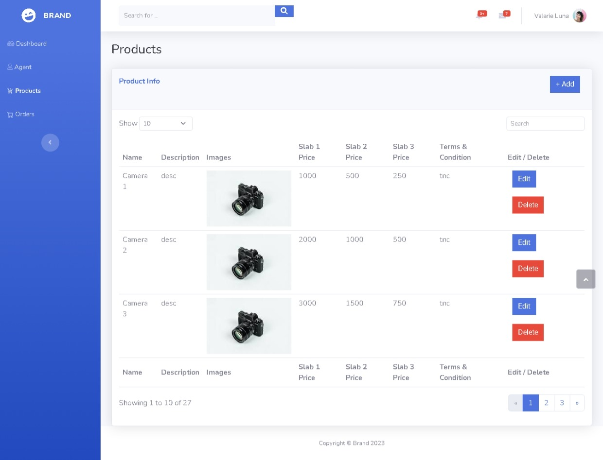

# Bootstrap Admin Template

A responsive and modern admin dashboard template built using **Bootstrap Studio**. This template includes pages for dashboard, agents, orders, and products — ideal for use in admin panels, CMS, or any back-office web application.

## 🚀 Demo

Check out the live demo here:  
🔗 [Live Preview](https://gaurav110601.github.io/bs-admin-template/admin.html)

## 📁 Project Structure

The template includes the following key pages:

- **Dashboard**: Overview of important metrics and UI components.
- **Agents**: List and manage agent data.
- **Orders**: View and manage customer orders.
- **Products**: Display and edit product listings.

## 📦 Technologies Used

- **Bootstrap 5**
- **Bootstrap Studio** (for design and export)
- **HTML5**
- **CSS3**
- **JavaScript**

## 💡 Features

- Fully responsive layout
- Clean and minimal UI
- Modular code structure
- Easy to customize and extend

## 🛠 Customization

You can open this project in **Bootstrap Studio** to:
- Modify components
- Add or remove pages
- Integrate your backend APIs
- Change styling or layout

## 📸 Screenshots

### Dashboard

### Agents Page

### Orders Page

### Products Page

---

Feel free to fork, customize, and use it in your own projects!
